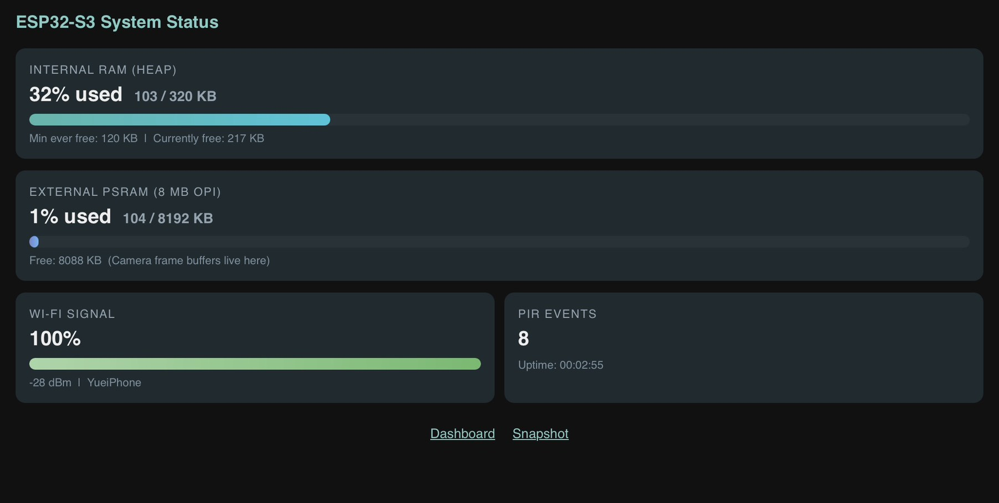
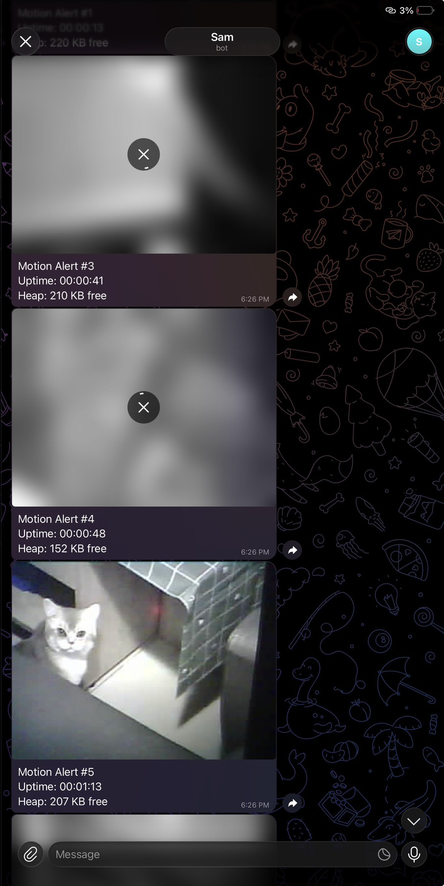
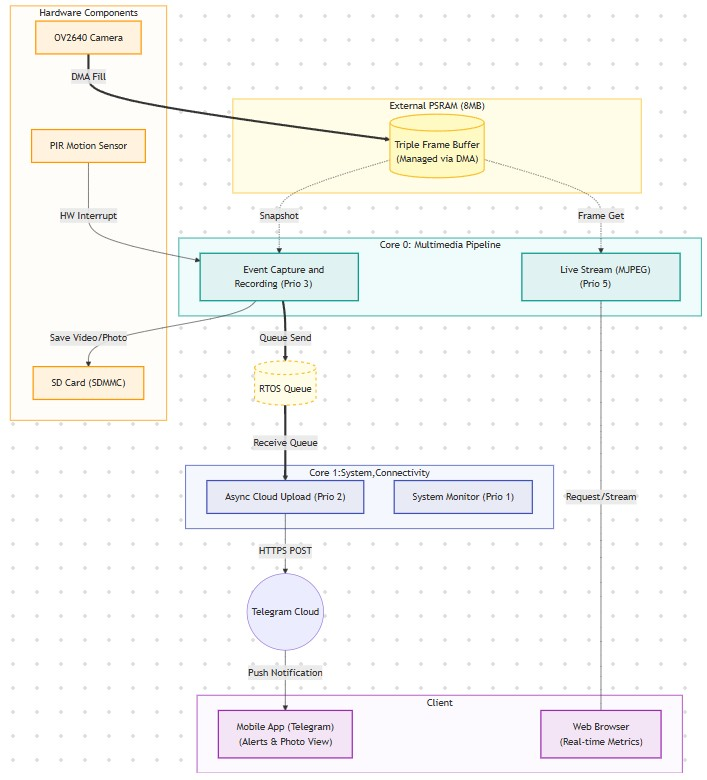

# ESP32-S3 High-Performance Pet Monitor

A simple but high-performance pet camera project using the ESP32-S3. This project solves the common problem where older ESP32 cameras lag or crash when trying to stream and upload photos at the same time.

---

## System Showcase

### 1. Status Dashboard
A clean web page to check how the ESP32 is doing (Memory usage, WiFi signal, and PIR counts).

### 2. Telegram Alerts
When the sensor picks up movement, it snaps a photo and sends it to your phone immediately.

---

## Architecture

We used a **Dual-core** setup here. Core 0 handles the camera and streaming, while Core 1 does the heavy lifting (like HTTPS uploads to Telegram). This keeps the video smooth even when a photo is being sent.

---

## Why this project is different

*   **No more lagging**: Thanks to the dual-core and FreeRTOS setup, the camera never stops even during cloud uploads.
*   **Triple Buffering**: We utilized 8MB of PSRAM to buffer 3 frames at a time. This prevents storage and streaming tasks from fighting over the same data.
*   **Smooth 15 FPS Stream**: Most ESP32 streams are slow or jumpy, but this one is capped at 15 FPS for a steady viewing experience even on mobile.
*   **Background Jobs**: PIR triggers a "job queue" in the background so the main camera task isn't blocked by slow WiFi uploads.

---

## Hardware & Environment
*   **Dev Env**: PlatformIO (Arduino Framework)
*   **Hardware**: ESP32-S3 (8MB PSRAM), OV2640, PIR Sensor, MicroSD Card.

---
*Created by [chen870527](https://github.com/chen870527)*
